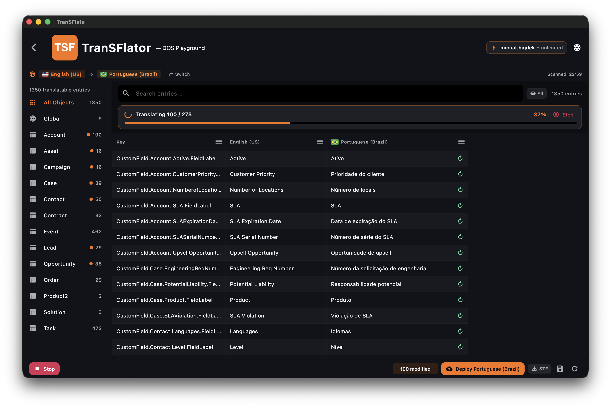

الترجمة المجمعة بالذكاء الاصطناعي (Batch AI translation) هي الميزة التي تجعل TranSFlator يستحق التثبيت. حدد الصفوف، وانقر على **AI all**، واختر محركاً، وسيقوم التطبيق ببث الترجمات من مزود الذكاء الاصطناعي إلى الشبكة فور وصولها.

## بدء دفعة

1. قم بتصفية والبحث في الشبكة حتى تظهر الصفوف التي تريد ترجمتها فقط.
2. انقر على **Select all visible** (تحديد الكل) (⌘/Ctrl + Shift + A).
3. انقر على **AI all** في شريط الأدوات.
4. اختر محركاً ومنطقة.
5. قم بالتأكيد.

## اختيار المحرك

يظهر منتقي المحركات كل محرك قمت بتمكينه في حسابك والتكلفة التقديرية للصفوف المختارة. راجع [نظرة عامة على المحركات](/ar/ai-engines/overview/) للمقارنة.

## اختيار المنطقة

أين تتم معالجة طلب الترجمة جغرافياً. ذو صلة بمتطلبات إقامة البيانات — يتيح لك بعض مزودي الذكاء الاصطناعي الاختيار بين الولايات المتحدة والاتحاد الأوروبي وآسيا وأستراليا. يقوم TranSFlator بتوجيه اختيار منطقتك إلى النظام الخلفي، والذي بدوره يوجه الطلب إلى نقطة نهاية المزود الصحيحة.

## التقدم المباشر

يظهر شريط في الأسفل الصفوف المكتملة / الإجمالي، والمعدل الحالي، والوقت المتبقي المقدر. يمكنك الإلغاء في منتصف الدفعة — يتم الاحتفاظ بالصفوف التي وصلت بالفعل في الشبكة (لم يتم حفظها في مساحة العمل بعد؛ احفظ باستخدام ⌘/Ctrl + S).

## الإخفاقات

إذا رفض مزود الذكاء الاصطناعي صفاً معيناً (طويل جداً، أحرف غير مدعومة، حظر سياسة المحتوى)، يظل هذا الصف فارغاً ويتم تسجيل الخطأ في شريط جانبي. يمكن إعادة محاولة الصفوف الفاشلة بشكل فردي أو تجاوزها تماماً.

## نموذج التكلفة

تستهلك كل دفعة أرصدة ذكاء اصطناعي من رصيد حسابك. تستهلك الأرصدة لكل حرف من النص **المصدر**، وليس لكل صف — تسمية حقل مكونة من 10 أحرف تكلف 10 أرصدة بغض النظر عن المحرك الذي تستخدمه. راجع [أرصدة الذكاء الاصطناعي](/ar/account-panel/ai-credits/) لمعرفة نموذج التسعير الكامل.

شريط التقدم في الجزء العلوي من الشبكة مباشر: يتم ملء الصفوف مع استجابة الذكاء الاصطناعي، ويقوم زر **Stop** (إيقاف) بإلغاء الطلبات المتبقية دون فقدان الصفوف التي وصلت بالفعل.
