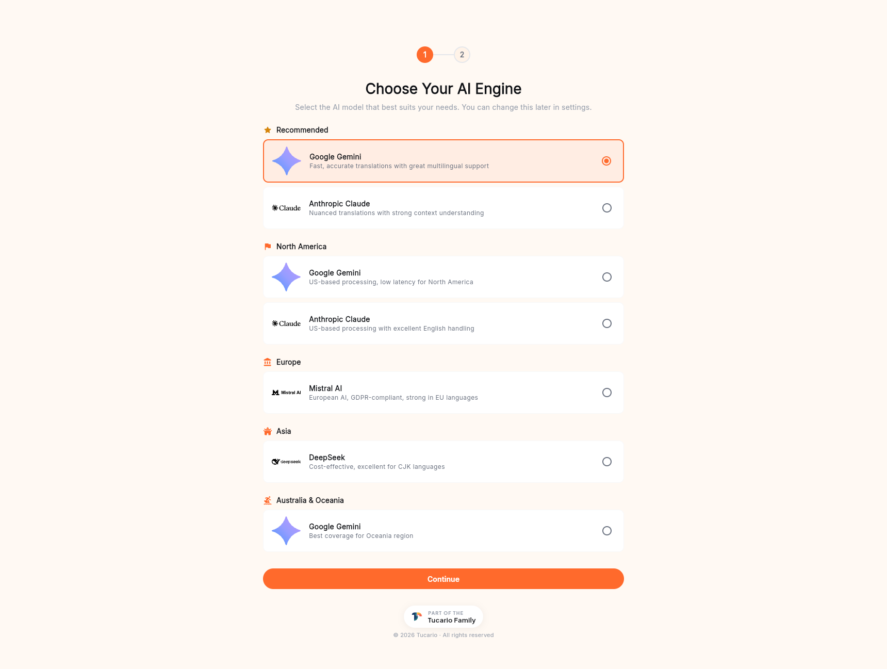

El panel principal es lo que ve inmediatamente después de iniciar
sesión. Responde a las tres preguntas por las que normalmente
acude al panel: *cuántos créditos me quedan, si la API está en
buen estado y cuánto he traducido últimamente*.

## Qué muestra cada tarjeta

**AI Characters**: su saldo actual de créditos y la fecha de la
próxima renovación (plan gratuito: cada 30 días, planes de pago:
el primer día de su ciclo de facturación). El botón **Buy
Characters** salta directamente al flujo de compra.

**Batch-translate with AI**: un recordatorio de qué motores están
conectados (Gemini · Claude · Mistral · DeepSeek) y de que puede
cambiar entre ellos en cualquier momento desde **API Settings**.

**Usage · Last 30 days**: un recuento continuo de los caracteres
traducidos en los últimos 30 días entre todos los motores. Útil
para calcular a ojo si su asignación gratuita durará todo el mes.

**Top language pairs · 30d**: lista clasificada de los pares
origen→destino que más utiliza. Vacía en una cuenta nueva; se
rellena automáticamente tras ejecutar sus primeros lotes.

**Recent translations**: las últimas filas que ha traducido.
Hacer clic en **Translation History** (barra lateral izquierda)
abre el registro completo.

**API Health · 24h**: latencia media y recuento de peticiones
contra su token de API durante las últimas 24 horas. Si observa
un pico de latencia o de peticiones que no ha iniciado usted,
rote el token de inmediato (consulte
[API settings](/account-panel/api-token/)).

**Credits forecast**: una proyección sencilla de cuándo se
agotará su saldo actual, basada en su tendencia de uso reciente.
Se rellena tras unos días de actividad.

## Incorporación inicial

Las cuentas nuevas que acaban de verificar su correo electrónico
pasan por un flujo de incorporación de dos pasos antes de que el
panel se cargue por primera vez.

### Paso 1 — Elija su motor de IA

TranSFlator funciona con cuatro motores de IA; usted elige uno
como predeterminado para los nuevos lotes. El selector los agrupa
así:

- **Recommended**: opciones de propósito general: Google Gemini
  para traducción multilingüe rápida y precisa; Anthropic Claude
  para trabajo matizado y sensible al contexto.
- **Norteamérica**: procesamiento en EE. UU. para tráfico NA de
  baja latencia.
- **Europa**: Mistral AI, conforme con el RGPD y sólido en
  idiomas de la UE.
- **Asia**: DeepSeek, rentable y sólido en CJK.
- **Australia y Oceanía**: Gemini, la mejor cobertura regional.

La elección no es definitiva. Puede cambiar de motor en cualquier
momento desde la pantalla **API Settings** o en la configuración
de lotes de la aplicación de escritorio.

### Paso 2 — Elija su plan

El plan gratuito (5.000 caracteres cada 30 días, acceso a la API,
todos los idiomas compatibles) es suficiente para evaluar
TranSFlator de principio a fin e incluso para cubrir
organizaciones pequeñas. Para volúmenes mayores, la tarjeta
**Premium** abre el selector de paquetes; consulte
[Comprar créditos](/account-panel/buying-credits/) para más
detalles.

Haga clic en **Continue with Free Plan** para terminar la
incorporación y aterrizar en el panel. Puede comprar paquetes en
cualquier momento posterior desde el botón **Buy Characters** del
panel o desde la entrada **Buy Characters** de la barra lateral.
