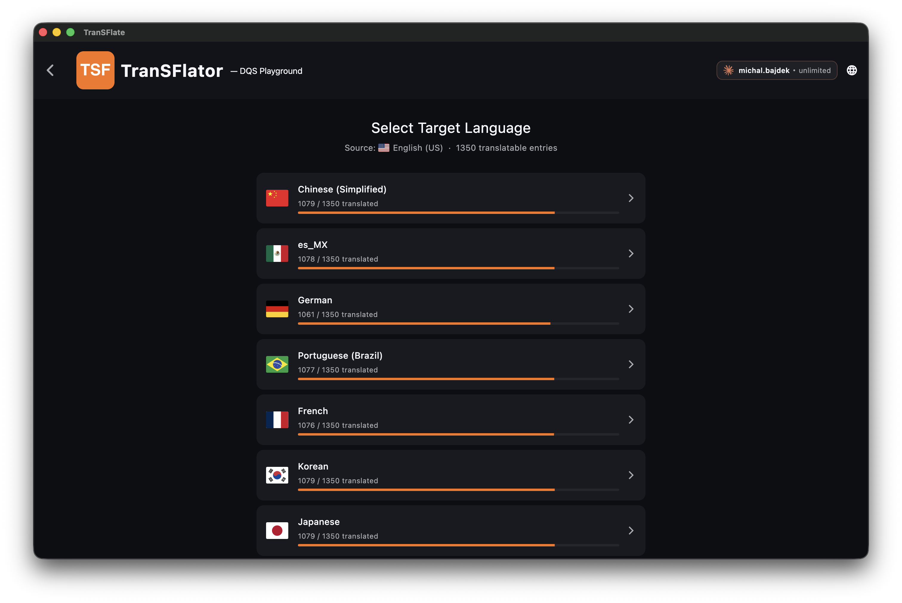

By the end of this page you'll have:

1. Scanned a sandbox org
2. Filtered to a handful of custom fields
3. Batch-translated them to a target language with AI
4. Deployed the result back to Salesforce

Total time: under ten minutes. Cost: a few hundred characters of AI
credit.

## 1. Pick a safe target

Do this on a **sandbox** first, never directly on production.
TranSFlator deploys are atomic and can be rolled back, but
confidence is cheaper than regret.

Open the sandbox connection you made in
[Connect your Salesforce org](/getting-started/connect-your-org/).

## 2. Scan

The app scans your org on first open. Depending on org size this
takes 10 seconds to a few minutes. You'll see the translation grid
populate with every translatable element: custom fields, picklist
values, record types, help text, layouts, web links, validation
rules, custom labels.

## 3. Narrow down

Click the **Filter** icon and pick **Custom Field → Label** to limit
the grid to just custom field labels. Check the box in the
**Missing** column to show only rows that haven't been translated
yet. You should be down to a few rows.

## 4. Pick a target language

Click the language picker at the top and pick a language you don't
already have translations for (e.g. **Polish**). The grid now shows
source on the left, target column on the right, empty.

Each row shows how many of the translatable entries are already
covered in that language — a quick way to spot which locales need
attention.

## 5. Translate

Click **AI all** on the top bar. A dialog appears asking which AI
engine to use — pick one. See
[Engines overview](/ai-engines/overview/) if you're not sure.

The app sends each row to the TranSFlator backend, which routes the
request to the engine you picked. Results stream into the grid as
they come back. You can edit any row by hand — the AI suggestion
becomes a starting point, not a final answer.

## 6. Deploy

Click **Deploy**. The app packages the changes into a metadata
deployment, signs the request with your connection's access token,
and pushes it to Salesforce's Metadata API. You'll see a progress
dialog and then either:

- **Success** — the changes are live in your sandbox.
- **Partial failure** — the app shows you exactly which components
  were rejected and why. Most of the time it's a managed-package
  field that Salesforce won't let anyone touch; the app flags
  these and skips them on retry.

## 7. Verify

Open your sandbox in a browser, switch the UI language to the one
you just translated, and check that the custom fields read as
expected.

## Next

Ready to go wider? Read
[Batch AI translation](/desktop-app/batch-ai-translate/) for the
full capability set.
