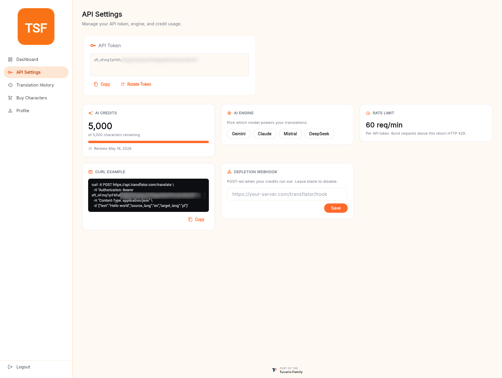

左サイドバーの **API Settings** は、API を直接利用するためのコントロールパネルです。デスクトップアプリはこれらの値のほとんどを自動的に読み取りますが、この画面は CI、スクリプト、サードパーティ統合から自分で API を呼び出したい場合のために存在します。



## API トークン

すべての TranSFlator アカウントには 1 つの API トークン — 翻訳 API に対してアカウントを認証する長いランダム文字列 — があります。

トークンカードは、現在の値をデフォルトでマスク表示し、2 つのアクションを提供します。

- **Copy**（コピー） — 完全なトークンをクリップボードにコピーします。パスワードと同様に取り扱ってください。
- **Rotate Token**（トークンのローテーション） — 現在のトークンを無効化し、新しいトークンを発行します。トークンが漏洩した可能性がある場合（公開リポジトリにプッシュした、チャットに投稿した、ログファイルに残した）や、通常のローテーションポリシーの一環として使用します。

ローテーション後は、古いトークンをまだ保持しているデスクトップアプリやスクリプトは、次の呼び出しで `HTTP 401 Unauthorized` を受け取り、サインインし直すか設定を更新する必要があります。

## AI クレジット

ダッシュボードの残高カードのミラーで、直接 API を利用するユーザーがトークンとエンジンピッカーの隣に残高を見たいことが多いため、ここにも表示しています。残り文字数、プランの上限、更新日が表示されます。

## AI エンジン

API 経由で開始される翻訳をどのモデルに担当させるかを選択します。

- **Gemini** — Google の汎用多言語モデル。
- **Claude** — Anthropic、繊細で文脈を汲み取る。
- **Mistral** — ヨーロッパ製、GDPR に配慮、EU 言語に強い。
- **DeepSeek** — コスト効率に優れ、CJK に強い。

選択は、ボディで `engine` を上書きしないすべての `POST /translate/batch` 呼び出しに適用されます。ここでエンジンを変更すると、ユーザードキュメント上の `preferred_ai_model` も更新されるため、デスクトップアプリは次回のハイドレーション時にこれを反映します。

## レート制限

トークンごとの現在のレート制限（デフォルトでは 60 req/min）を表示します。これを超えるバーストは `HTTP 429 Too Many Requests` を返します — バックオフして再試行してください。この制限は API トークン単位で適用され、IP 単位ではないため、トークンをローテーションしてもリセットされません。

## cURL の例

API トークンが事前入力され、バッチ翻訳エンドポイントを指す、貼り付けてすぐに使える呼び出し例です。

```bash
curl -X POST https://api.transflator.com/translate \
  -H "Authorization: Bearer <YOUR_API_TOKEN>" \
  -H "Content-Type: application/json" \
  -d '{"text":"Hello world","source_lang":"en","target_lang":"pl"}'
```

カードの **Copy**（コピー）をクリックすると、実際のトークンが差し込まれた状態で取得できます。レスポンスは、翻訳された文字列と、どのエンジンが生成したかのメタデータを含む JSON オブジェクトです。

## 枯渇 Webhook

任意項目です。HTTPS URL を貼り付けておくと、クレジット残高がゼロになった際に、JSON ペイロードを POST します。以下のような用途に便利です。

- 本番 API 統合のクレジットが尽きたときにオンコールを呼び出す。
- ご自身の課金システムで自動補充をトリガーする。
- Slack のインカミング Webhook 経由で通知を送る。

フィールドを空にしておくと無効化されます。Webhook は枯渇イベントごとに 1 回のみ発火し（以降の 429 ごとには発火しません）、次回の補充または更新時に再アームされます。
