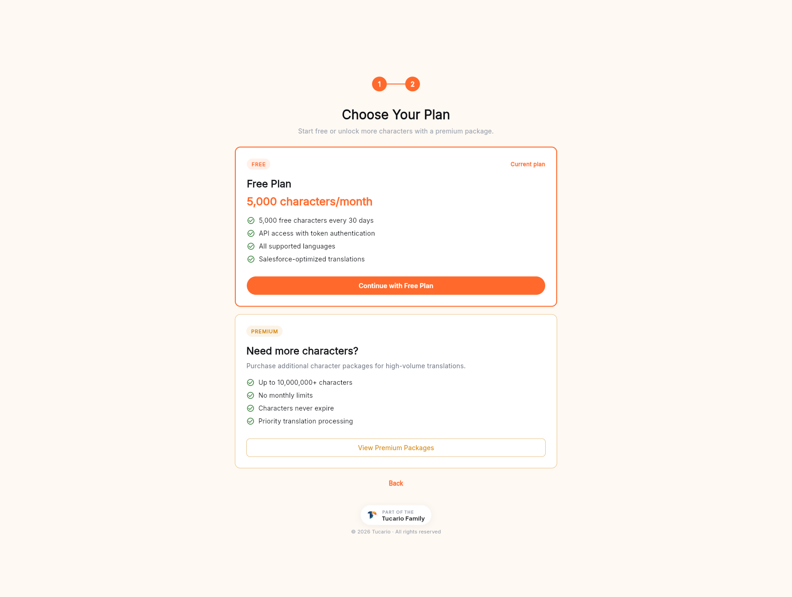

無料プランの月次枠を超えて翻訳したい場合は、いつでも追加のクレジットを補充できます。決済は **Stripe** で処理されます。

## プランを選択する

プランピッカーは、初回オンボーディング時と、サイドバーの **Buy Characters** エントリーの両方から利用できます。

**Free plan** — 30 日サイクルあたり 5,000 文字、完全な API アクセス、対応する全言語、Salesforce 向けに最適化されたプロンプト。小規模な組織、評価、軽微なメンテナンス作業には十分です。

**Premium** — 月次枠に加えて追加の文字数パッケージ：

- パッケージあたり最大 10,000,000 文字以上。
- 月次上限なし — ご自身のペースで利用できます。
- **文字数は期限切れになりません。** 月次の無料枠とは異なり、購入したクレジットは使い切るまで残高に残ります。
- バックエンドキューでの優先翻訳処理。

**View Premium Packages** をクリックするとパッケージ一覧が開き、サイズを選べます。

## 補充フロー

1. パネルで **Buy Characters**（サイドバーまたはダッシュボードカード）→ **View Premium Packages** をクリックします。
2. 一覧からパッケージサイズを選択します。
3. **Checkout**（チェックアウト）をクリックします — Stripe のドメインでホストされる Stripe Checkout が開きます。カード情報は Stripe のサーバー上で入力され、弊社のサーバーには送信されません。
4. 支払いを完了します。
5. Stripe がパネルにリダイレクトします。Stripe の Webhook が弊社バックエンドで発火し、`purchases` ドキュメントを Firestore に書き込んで、`ai_credits` 残高をアトミックに加算します。
6. 新しい残高は数秒以内にダッシュボードに反映されます。

## 保存される情報

完了したすべての購入ごとに、Firestore の `purchases` コレクションにドキュメントが作成され、お客様の `uid`、Stripe セッション ID、Stripe 支払いインテント、支払金額、通貨、購入文字数が記録されます。弊社は、カード番号、CVV、その他のカード会員データを **保存しません**。

## 領収書

Stripe は決済が確定した時点で、TranSFlator アカウントに登録されたアドレスへメール領収書を送信します。これが記録用の正式な領収書です。

## 決済の失敗

決済が拒否された場合、Stripe の Webhook は発火せず、購入は記録されず、クレジットも加算されません。弊社側では何も変わりません。別のカードで再度お試しください。

## EU のお客様向けの VAT / 請求書

Stripe は Customer Portal を通じて VAT 対応の請求書を発行します。セルフサービスの請求書履歴はパネルで予定されている機能です。それまでは、アカウントのメールアドレスを添えて [hello@tucario.com](mailto:hello@tucario.com) までメールいただければ PDF をお送りします。
