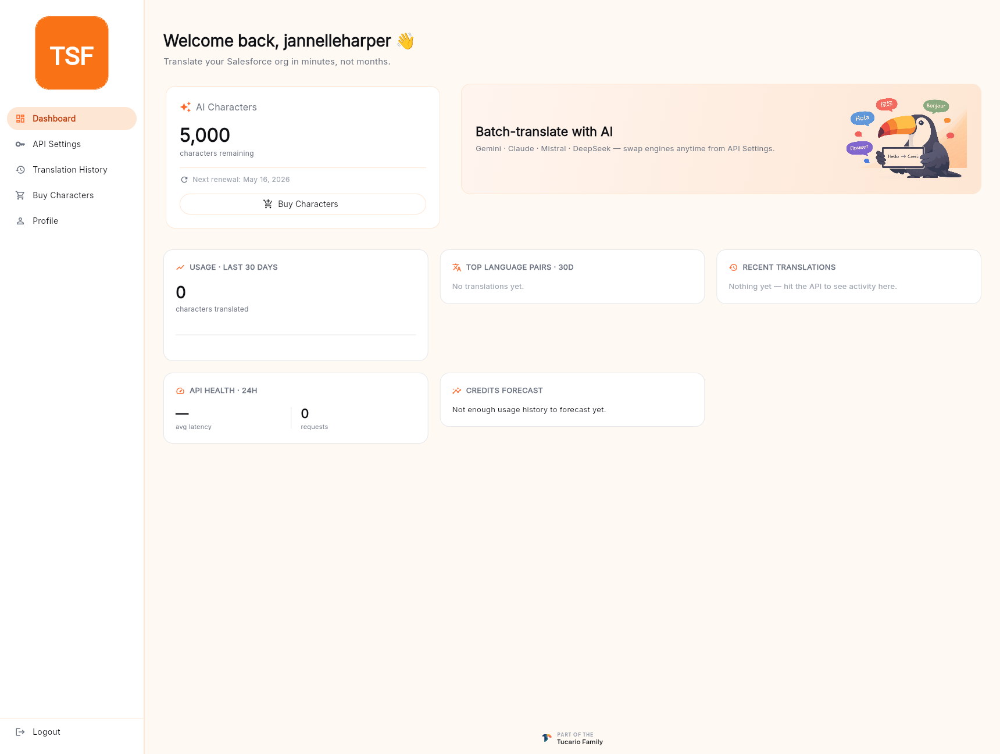

ダッシュボードは、サインイン直後に最初に表示される画面です。パネルを開く際にたいてい気になる 3 つの質問に答えます。すなわち、*残りクレジットはいくつか、API は正常か、最近どれだけ翻訳したか* です。

## 各タイルの内容

**AI Characters** — 現在のクレジット残高と次回更新日（無料プラン：30 日ごと、有料プラン：請求サイクルの初日）。**Buy Characters**（文字数を購入）ボタンから購入フローに直接ジャンプできます。

**Batch-translate with AI** — 接続されているエンジン（Gemini · Claude · Mistral · DeepSeek）の確認と、**API Settings** からいつでもエンジンを切り替えられることのリマインダー。

**Usage · Last 30 days** — 全エンジンにわたり過去 30 日間に翻訳した文字数のランニングカウント。無料枠がその月中もつかをざっと見積もるのに便利です。

**Top language pairs · 30d** — 最も使われたソース→ターゲットの言語ペアを順位付けしたリスト。新規アカウントでは空で、最初のバッチを実行すると自動的に埋まります。

**Recent translations** — 最近翻訳した行の末尾。左サイドバーの **Translation History** をクリックすると完全なログが開きます。

**API Health · 24h** — 過去 24 時間における、API トークンに対する平均レイテンシとリクエスト数。レイテンシや自分が発行していないリクエストの急増が見られた場合は、直ちにトークンをローテーションしてください（[API 設定](/account-panel/api-token/) をご覧ください）。

**Credits forecast** — 最近の使用傾向に基づいて、現在の残高がいつ枯渇するかを単純に予測したもの。数日分のアクティビティが蓄積すると表示されます。

## 初回オンボーディング

メールアドレスを確認したばかりの新規アカウントは、ダッシュボードが初めて読み込まれる前に 2 ステップのオンボーディングフローに誘導されます。

### ステップ 1 — AI エンジンを選択

TranSFlator は 4 つの AI エンジンに対応しており、新規バッチのデフォルトとして 1 つを選択します。ピッカーは次のようにグループ化されています。

- **Recommended** — 汎用のデフォルト：高速で精度の高い多言語翻訳の Google Gemini、文脈を汲み取る繊細な作業に向く Anthropic Claude。
- **North America** — 低レイテンシな北米トラフィック向けの米国処理。
- **Europe** — Mistral AI、GDPR 準拠で EU 言語に強い。
- **Asia** — DeepSeek、コスト効率に優れ CJK に強い。
- **Australia & Oceania** — Gemini、地域カバレッジが最良。

選択は固定されません。**API Settings** 画面から、またはデスクトップアプリのバッチ設定から、いつでもエンジンを切り替えられます。

### ステップ 2 — プランを選択

無料プラン（30 日あたり 5,000 文字、API アクセス、対応する全言語）は、TranSFlator をエンドツーエンドで評価するのに十分で、小規模な組織であればそれだけでカバーできます。大量の処理が必要な場合は **Premium** カードからパッケージピッカーが開きます — 詳細は [クレジットの購入](/account-panel/buying-credits/) をご覧ください。

**Continue with Free Plan** をクリックするとオンボーディングが完了し、ダッシュボードに遷移します。パッケージの購入は、ダッシュボードの **Buy Characters** ボタンやサイドバーの **Buy Characters** エントリーから、後でいつでも行えます。
