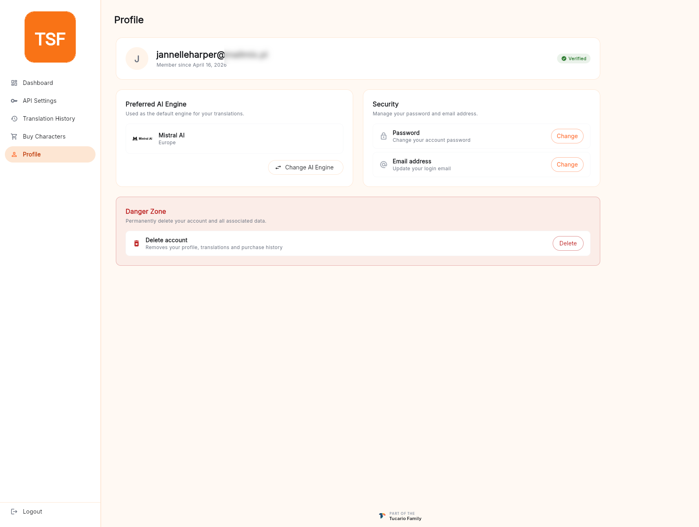

**Profile**（プロフィール）画面は、パネルサイドバーの最後のエントリーです。請求や翻訳履歴に該当しないものはすべてここにあります。

## アカウントヘッダー

サインインに使用しているメールアドレス（スクリーンショットではマスク）、登録日、およびメール確認が完了すると表示される **Verified** バッジを示します。バッジがない場合は、戻って [メールアドレスの確認](/account-panel/sign-up/#verify-your-email) を完了してください。

## 優先 AI エンジン

現在デフォルトとして設定されているエンジンの概要と、**Change AI Engine**（AI エンジンを変更）ボタンが表示されます。クリックすると、オンボーディング中に表示されたのと同じエンジンピッカーが再度開きます（[ダッシュボード — 初回オンボーディング](/account-panel/dashboard/#first-run-onboarding) をご覧ください）。

ここでエンジンを変更すると、ユーザードキュメント上の `preferred_ai_model` フィールドが更新されます。新しい翻訳（パネル、デスクトップ、明示的な `engine` を指定しない API）は、直ちにこれを反映します。

## セキュリティ

2 つの独立したアクションがあります。

- **Password — Change**（パスワード — 変更） — 現在のパスワードを再入力させ、その後新しいパスワードを 2 回入力させるダイアログを開きます。Firebase Auth では更新がアトミックに成功し、他のセッションはサインアウトされません。そのため、漏洩が疑われて変更する場合は、[API トークン](/account-panel/api-token/) もローテーションしてください。
- **Email address — Change**（メールアドレス — 変更） — 新しいアドレスに確認リンクを送信します。変更はそのリンクをクリックしたときにのみ有効になります。それまでは、古いアドレスでサインインが引き続き動作します。

## Danger Zone

画面下部にある赤い枠のカードです。唯一のアクションは **Delete account**（アカウント削除）で、誤ってクリックされないよう意図的に離して配置されています。**Delete** をクリックすると、[アカウントの削除](/account-panel/delete-account/) に記載されているカスケードが開始されます。

削除は **取り消し不可能** で、ユーザードキュメント、購入履歴、翻訳履歴、および Firebase Auth レコードを削除します。クリックする前にリンク先のページを必ずお読みください。
