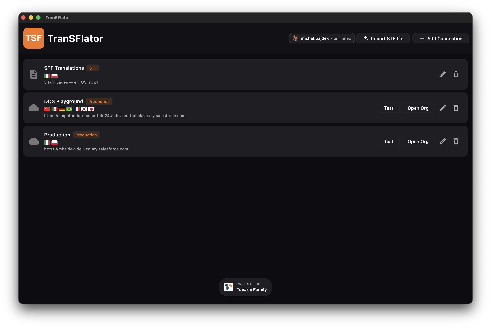

**Połączenie** (connection) w TranSFlatorze reprezentuje jedną organizację Salesforce, w której
się uwierzytelniłeś. Każde połączenie to wiersz na pasku bocznym aplikacji
z własnym zaszyfrowanym tokenem odświeżającym, etykietą i znacznikiem czasu ostatniego testu.

Możesz dodać tyle połączeń, ile chcesz — produkcyjne, wiele
sandboxów, scratch orgs, organizacje klientów, jeśli jesteś konsultantem. Aplikacja trzyma je obok siebie, a przełączanie odbywa się jednym kliknięciem.

## Dodawanie, zmiana nazwy, usuwanie

Zobacz [Połącz swoją organizację Salesforce](/pl/getting-started/connect-your-org/)
dla opisu procesu dodawania. Aby zmienić nazwę, kliknij prawym przyciskiem myszy połączenie na
pasku bocznym → **Rename**. Aby usunąć, kliknij prawym przyciskiem myszy → **Delete**. Usunięcie
połączenia natychmiast wymazuje zaszyfrowany token odświeżający z
`transflate.db`; Salesforce nie jest informowany, więc token
odświeżający pozostanie ważny po stronie Salesforce, dopóki nie
unieważnisz go ręcznie w **Setup → Connected Apps OAuth Usage**.

## Testowanie połączenia

Mała kropka obok każdego połączenia pokazuje jego status:

- **Zielona** — ostatni test zakończony sukcesem, token ważny.
- **Pomarańczowa** — nietestowane w tej sesji, może być nieaktualne.
- **Czerwona** — ostatni test nieudany. Kliknij, aby uwierzytelnić się ponownie.

Kliknij dowolne połączenie, a aplikacja uderzy do `/services/data/v65.0/` na
organizacji, aby ponownie zweryfikować sesję przed załadowaniem obszaru roboczego. Jeśli
token został unieważniony lub wygasł, zostaniesz poproszony o ponowną autoryzację
poprzez normalny przepływ OAuth.

Przepływ importu tylko pliku STF (pierwszy wiersz powyżej) tworzy „pseudo
połączenie”, które nie posiada tokena odświeżającego — przechowuje ono tylko
sparsowaną zawartość pliku `.stf` i nie może wdrażać zmian w Salesforce,
dopóki nie podłączysz prawdziwej organizacji.
