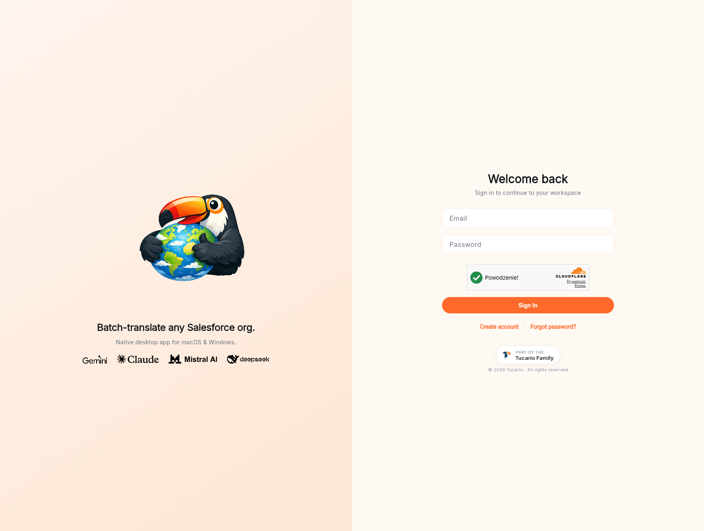
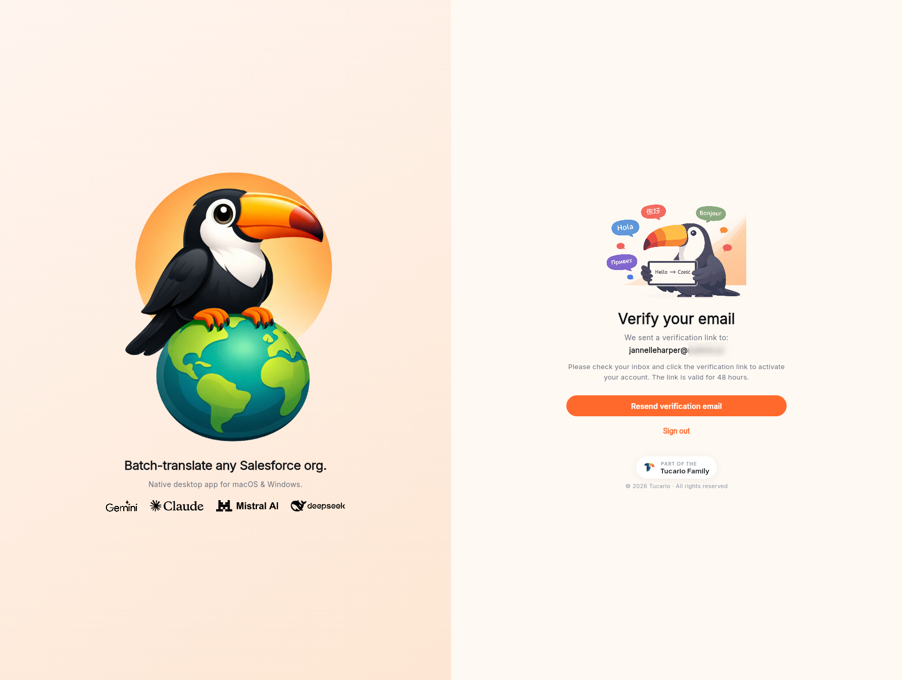

O painel de conta em
[panel.transflator.com](https://panel.transflator.com) é onde você
cria a conta contra a qual o aplicativo desktop faz login. É uma
aplicação Flutter Web suportada por Firebase Auth, Firestore e um
único endpoint do Cloud Functions.

## Login

Usuários recorrentes chegam à tela de login em
[panel.transflator.com](https://panel.transflator.com).

1. Digite seu e-mail e senha.
2. Resolva o desafio reCAPTCHA se solicitado.
3. Clique em **Sign in**.

O formulário envia para `POST /auth/login`, que faz proxy com o
Firebase Auth e retorna seu token de API por usuário. Esse mesmo
token é o que o aplicativo desktop recebe quando você faz login por lá.

Os links abaixo do formulário cobrem os dois desvios comuns:

- **Create account** — leva você ao fluxo de cadastro descrito
  abaixo.
- **Forgot password?** — envia um e-mail de redefinição pelo nosso
  pipeline transacional. O link de redefinição é válido por 1 hora.

## Cadastro

Se você ainda não tem uma conta, clique em **Create account** na
tela de login.

1. Digite seu endereço de e-mail e uma senha forte.
2. Resolva o desafio reCAPTCHA.
3. Clique em **Create account**.

O backend cria um usuário no Firebase Auth e um documento
correspondente na coleção `users` do Firestore, já com seu saldo
inicial de créditos de IA e um token de API recém-gerado.

## Verifique seu e-mail

Imediatamente após o cadastro, um e-mail transacional chega à sua
caixa de entrada contendo um link de verificação em um clique. O
link é válido por **48 horas**. Até você clicá-lo, não é possível
recarregar créditos ou executar traduções que custem créditos.

O painel bloqueia o restante da UI atrás de uma tela "Verify your
email" que mostra:

- Para qual endereço enviamos o link.
- Um botão **Resend verification email** — útil se o primeiro se
  perdeu ou se o link expirou.
- Um link **Sign out** caso você queira tentar uma conta diferente.

**Não recebeu o e-mail?** Verifique primeiro sua pasta de spam e
depois use **Resend verification email**. Se o próprio endereço
foi digitado incorretamente, saia, peça ao suporte para excluir a
conta e cadastre-se novamente — não há uma forma self-service de
editar o e-mail antes da verificação.

## Créditos iniciais

Novas contas recebem um saldo inicial gratuito para que você possa
avaliar o produto sem pagar. O valor e a cadência de renovação de
30 dias são mostrados no painel. O plano gratuito cobre pequenas
organizações, POCs rápidas e avaliações; trabalhos maiores
precisam de uma recarga de créditos (veja
[Comprar créditos](/account-panel/buying-credits/)).

## Redefinição de senha

Se você esquecer sua senha, clique em **Forgot password?** na tela
de login. Um e-mail de redefinição é enviado pelo mesmo pipeline
transacional, com um link válido por **1 hora**. O link abre uma
tela do painel onde você define uma nova senha; após salvar, você
é levado de volta ao formulário de login.
