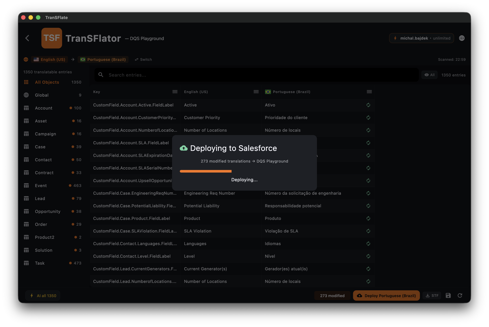
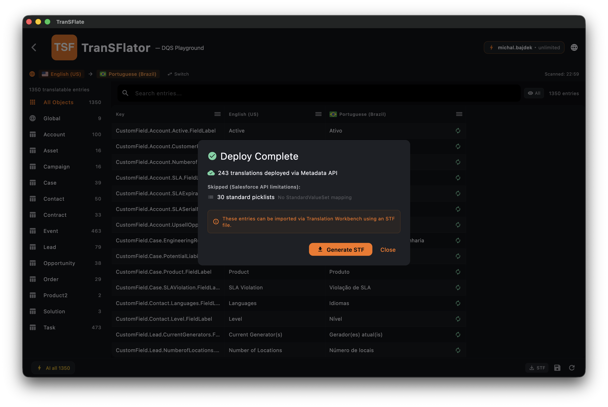

A implantação pega as linhas traduzidas da sua grade e as envia de volta para o Salesforce usando a API de Metadados. É a última etapa do fluxo de trabalho normal.

## O que é implantado

Apenas as linhas que (a) não estão vazias na coluna do idioma de destino e (b) foram alteradas desde a última implantação bem-sucedida para esta conexão. Linhas não alteradas são ignoradas. Linhas que você não tocou permanecem intocadas.

## Atômico com rollback

As implantações são enviadas como uma única transação da API de Metadados. Se qualquer componente falhar na validação do lado do Salesforce, **toda a implantação é revertida (rollback)** e você verá um diálogo listando cada componente que falhou e o porquê. Sua organização nunca fica em um estado parcialmente aplicado.

## Erros por componente

A visualização de erro mostra:

- A chave de metadados do Salesforce que falhou (ex: `Account.Industry__c.Label.pt_BR`)
- A mensagem de erro literal do Salesforce
- Um botão **Skip and retry** que exclui a linha com erro e tenta a implantação novamente

## Pacotes gerenciados

O Salesforce não permite a modificação de metadados de campos pertencentes a um pacote gerenciado que você não tenha desenvolvido. O TranSFlator detecta esses campos durante a verificação e os marca como somente leitura na grade, para que você não perca tempo tentando traduzir algo que nunca será implantado.

## Log

Cada implantação é registrada na tabela local `deployment_log` com carimbo de data/hora, conexão, número de componentes e o status final. Nada é enviado para o nosso backend.

Quando a implantação termina, você recebe um resumo mostrando quantos componentes foram realmente aplicados e quantos foram ignorados porque a API do Salesforce se recusa a tocá-los (por exemplo, listas de opções padrão cujos valores pertencem à plataforma):

As entradas ignoradas podem ser exportadas via **Generate STF** e importadas com o Workbench de Tradução do Salesforce, que é a única ferramenta autorizada a tocar nesses registros.
