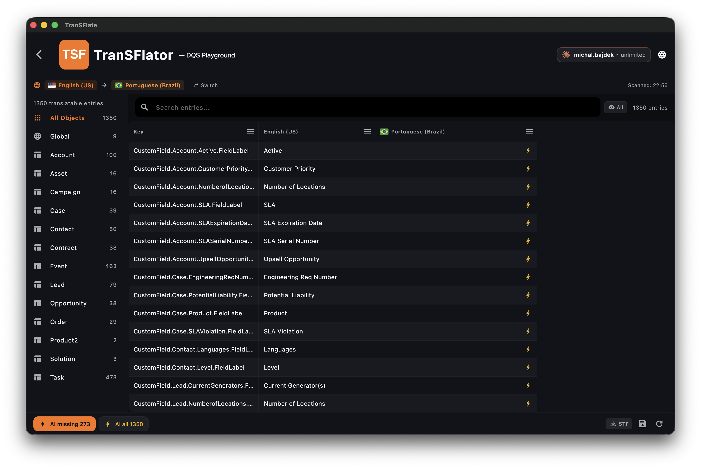

A grade de tradução é uma visualização de nível de planilha de cada elemento traduzível em sua organização. Ela foi construída para escalar para dezenas de milhares de linhas e permanecer responsiva.

## Colunas

- **Type** — campo personalizado, lista de opções, layout, regra de validação…
- **Key** — a chave de metadados do Salesforce (somente leitura)
- **Source** — sua string no idioma padrão
- **Target** — a string para o idioma selecionado no momento, editável

## Filtros

A barra lateral de filtros à esquerda permite filtrar por tipo, objeto, idioma e "apenas traduções ausentes". Os filtros são cumulativos — você pode solicitar *"rótulos de campos personalizados no objeto Account, com traduções para italiano ausentes"* em três cliques.

## Pesquisa

A caixa de pesquisa no topo faz correspondência de substring e é em tempo real. Ela pesquisa tanto na origem quanto no destino.

## Atalhos de teclado

| Atalho | Ação |
| --- | --- |
| `↑` / `↓` | Mover entre as linhas |
| `Enter` | Editar a linha atual |
| `Esc` | Descartar edição não salva |
| `⌘/Ctrl + S` | Salvar workspace atual |
| `⌘/Ctrl + F` | Focar na pesquisa |
| `⌘/Ctrl + Shift + A` | Selecionar todas as linhas visíveis |
| `⌘/Ctrl + D` | Marcar linha como "concluída" (revisada) |

A barra lateral esquerda agrupa cada elemento traduzível por objeto do Salesforce (Account, Case, Contact, …) com uma contagem progressiva para que você sempre saiba quanto falta.
