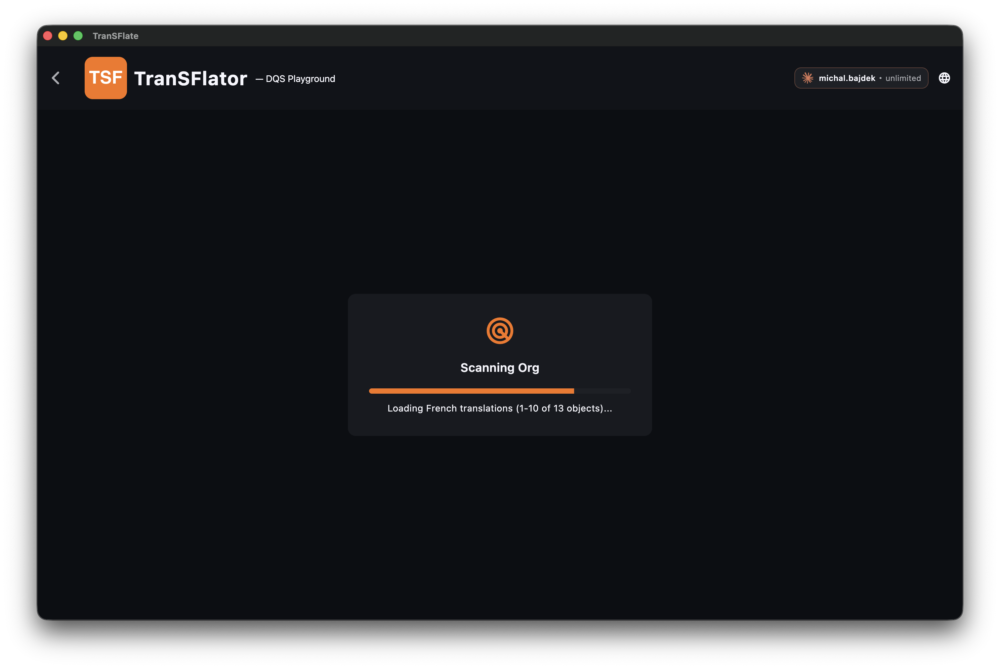

O TranSFlator se conecta ao Salesforce usando **OAuth 2.0 com PKCE (método de desafio de código S256)**. Não há uma etapa de "colar seu nome de usuário e senha" e o backend do TranSFlator não fica no meio — o código de autorização é trocado em sua própria máquina.

## Etapas

1. No aplicativo, clique em **Add Connection** no canto superior direito.
2. Dê um rótulo à conexão (ex: *"EMEA sandbox"* ou *"Acme production"*), escolha se é uma instância de **Production/Developer** (`login.salesforce.com`) ou um **Sandbox** (`test.salesforce.com`) e clique em **Authorize**.
3. Seu navegador será aberto. Faça login no Salesforce como você faz normalmente. Se sua organização usar SSO ou MFA, o fluxo normal será executado aqui.
4. O Salesforce solicitará que você permita que o **TranSFlator Connected App** acesse os metadados. Clique em **Allow**.
5. O Salesforce redireciona para `http://localhost:1717/oauth/callback`, que o aplicativo desktop está monitorando. O callback de loopback nunca sai da sua máquina.
6. O aplicativo troca o código de autorização por um token de atualização (refresh token) e um token de acesso. O token de atualização é criptografado com AES-256-CBC e gravado no `transflate.db`; o token de acesso fica apenas na RAM.

Agora você está conectado. A conexão aparece na barra lateral com um ponto de status verde. Clique nela para abrir a grade de tradução para aquela organização — o TranSFlator verificará imediatamente a organização em busca de todos os elementos traduzíveis:

## Usando um domínio personalizado

Se sua organização usa um Meu Domínio (`acme.my.salesforce.com`), escolha **Custom Domain** no seletor de instância e cole o nome de host completo `https://...`. O aplicativo usará isso como o host OAuth em vez do endpoint de login padrão.

## Scratch orgs

As scratch orgs funcionam exatamente como sandboxes: escolha **Sandbox** no seletor de instância. O token de atualização vive enquanto a scratch org existir — quando a scratch org expirar, o TranSFlator avisará no próximo teste de conexão.

## O que o TranSFlator vê

Uma vez conectado, o aplicativo tem o mesmo acesso a metadados que o seu usuário logado — nada mais. Se o seu usuário pode ver um campo, o TranSFlator pode traduzi-lo. Se o seu usuário não tem acesso a um tipo de registro, o TranSFlator também não poderá verificá-lo. Configure o conjunto de permissões (permission set) do seu usuário de teste antes de executar uma verificação completa se quiser limitar o raio de alcance.

## Próximo

[Execute sua primeira tradução →](/pt/getting-started/your-first-translation/)
